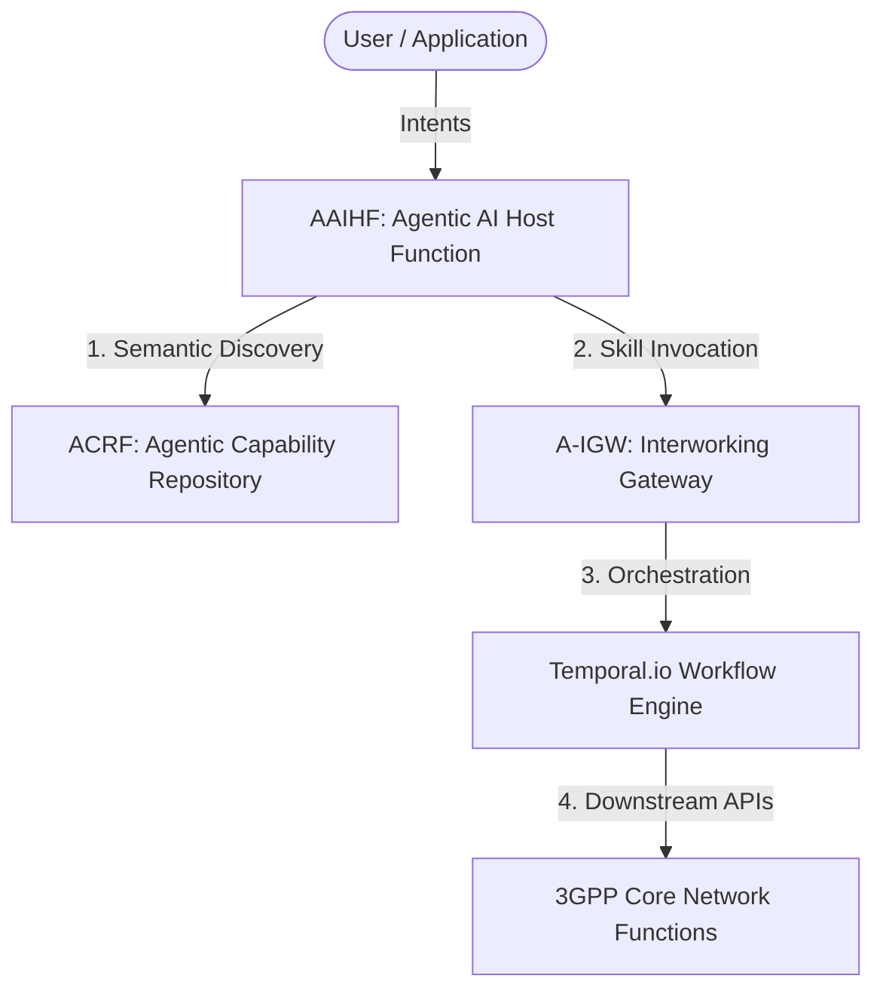
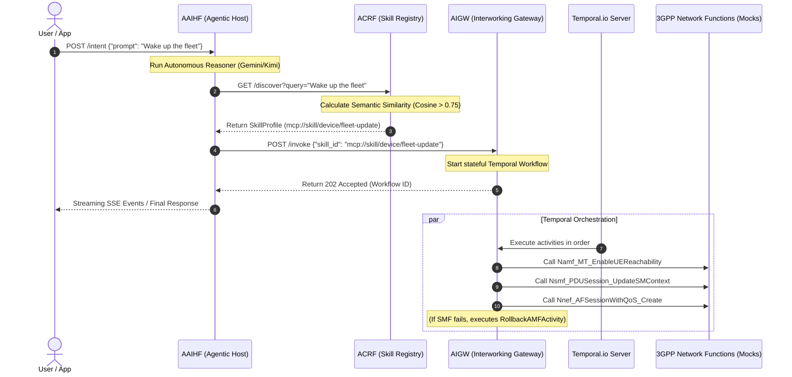

# 6G Skill-Based Agentic Core Network — Global Architectural Specs Summary (4+1 View Model)

This document provides a global perspective of the 14 specification files under [openspec/specs](file:///root/proj/go/agentic-layer-google/openspec/specs). It maps the project architecture using the 4+1 View Model.

The architecture decouples the AI reasoning layer (AAIHF) from deterministic, stateful 3GPP core network signaling (A-IGW), using the ACRF skill registry as the interface between them.



---

## 1. Logical View (Functional & Domain Model)
The logical view describes the object model, interfaces, entities, and static structures of the system.

### Skill Profile and Domain Modeling
*   Unified Skill Profile Struct: The project defines a [SkillProfile](file:///root/proj/go/agentic-layer-google/pkg/models/models.go) structure containing a mandatory description string used for semantic vector embeddings, alongside specific attributes for Device, Network, and App domains.
    *   Spec Reference: [agentic-models spec](file:///root/proj/go/agentic-layer-google/openspec/specs/agentic-models/spec.md)
    *   Code Implementation: [models.go](file:///root/proj/go/agentic-layer-google/pkg/models/models.go)
*   Service Class Priority: Defines the [ServiceClass](file:///root/proj/go/agentic-layer-google/pkg/models/models.go) enum (GOLD, SILVER, BRONZE, PLATINUM) to categorize network capabilities by priority.
    *   Spec Reference: [agentic-models spec](file:///root/proj/go/agentic-layer-google/openspec/specs/agentic-models/spec.md)

### Agent Tooling Interfaces
*   Agent Tools: The reasoning agent uses two core tool definitions:
    1.  SearchSkill: Wraps the ACRF `/discover` endpoint to find skill profiles.
    2.  ExecuteSkill: Wraps the A-IGW `/invoke` endpoint to run a selected skill.
    *   Spec Reference: [agent-tooling spec](file:///root/proj/go/agentic-layer-google/openspec/specs/agent-tooling/spec.md)
    *   Code Implementation: [tools.go](file:///root/proj/go/agentic-layer-google/internal/agent/tools.go)

### AI Providers and Compatibility
*   OpenAI-Compatible LLM Provider: Implements the model.LLM interface for generic OpenAI-compatible endpoints. It maps adk-go tool definitions to the OpenAI format, formats tool execution payloads, and supports base URL overrides (e.g. for Moonshot/Kimi).
    *   Spec Reference: [openai-compatible-llm-provider spec](file:///root/proj/go/agentic-layer-google/openspec/specs/openai-compatible-llm-provider/spec.md)
    *   Code Implementation: [provider.go](file:///root/proj/go/agentic-layer-google/internal/agent/openai/provider.go)

### Semantic Matching Engine
*   Semantic Vector Embeddings: Uses Gemini to generate embedding vectors (float32 slices) from text descriptions, calculating similarity via Cosine Similarity.
*   Search Thresholding: Limits semantic matching to matches with a cosine similarity score of 0.75 or higher.
    *   Spec Reference: [semantic-matching-engine spec](file:///root/proj/go/agentic-layer-google/openspec/specs/semantic-matching-engine/spec.md)
    *   Code Implementation: [embeddings.go](file:///root/proj/go/agentic-layer-google/internal/registry/embeddings.go)

---

## 2. Process View (Workflows & Runtime Communication)
The process view details runtime interactions, concurrency, and dynamic workflows between components.



### Intent Reception and Reasoning Loop
*   Intent Resolution: AAIHF processes user queries via the `/intent` endpoint. It runs an autonomous adk-go loop (using Gemini or Kimi based on configuration) which discovers a skill (via SearchSkill) and invokes it (via ExecuteSkill).
    *   Spec Reference: [intent-resolution spec](file:///root/proj/go/agentic-layer-google/openspec/specs/intent-resolution/spec.md)
    *   Code Implementation: [agent.go](file:///root/proj/go/agentic-layer-google/internal/agent/agent.go)

### Stateful Temporal Workflow Orchestration
*   Reliable Orchestration: Handles asynchronous execution via Temporal workflows that coordinate sequential 3GPP service activities.
*   Compensations/Rollbacks: If an operation fails permanently (e.g. SMF context update), the system executes compensating activities (e.g. AMF reachability rollback) to prevent configuration drift.
    *   Spec Reference: [temporal-skill-execution spec](file:///root/proj/go/agentic-layer-google/openspec/specs/temporal-skill-execution/spec.md)
    *   Code Implementation: [workflows.go](file:///root/proj/go/agentic-layer-google/internal/translator/temporal_skills/workflows.go) and [activities.go](file:///root/proj/go/agentic-layer-google/internal/translator/temporal_skills/activities.go)

### Observability Stream
*   Server-Sent Events (SSE): AAIHF broadcasts reasoning events (like reasoning_started and reasoning_completed) and tool execution details on `/stream`. It supports full CORS compliance (*) for browser-based dashboards.
    *   Spec Reference: [real-time-observability spec](file:///root/proj/go/agentic-layer-google/openspec/specs/real-time-observability/spec.md)
    *   Code Implementation: [server.go](file:///root/proj/go/agentic-layer-google/internal/agent/server.go)

---

## 3. Development View (Software Organization & Testing)
The development view highlights how code is structured, packaged, and verified.

### Directory Structure and Package Mapping
```
.
├── cmd/
│   ├── aaihf/                   # Agentic AI Host Function entrypoint
│   ├── acrf/                    # Agentic Capability Repository Function entrypoint
│   └── igw-fleet/               # Interworking Gateway (A-IGW) entrypoint
├── internal/
│   ├── agent/                   # Autonomous reasoner & LLM providers
│   ├── config/                  # Service configurations
│   ├── events/                  # Event broadcasting structures
│   ├── registry/                # ACRF and Semantic Search implementation
│   ├── testutil/                # Testing helpers & mocks
│   └── translator/              # A-IGW translation logic & Temporal worker
├── pkg/
│   └── models/                  # Shared domain model structs
└── tests/
    └── features/                # BDD system integration feature files
```

### Test-Driven Infrastructure ("The Test Wall")
*   BDD Integration: Employs godog BDD tests in [godog_test.go](file:///root/proj/go/agentic-layer-google/tests/godog_test.go) to verify paths from raw prompts to downstream signaling.
    *   Spec Reference: [test-infrastructure spec](file:///root/proj/go/agentic-layer-google/openspec/specs/test-infrastructure/spec.md)
    *   BDD Scenarios: [system.feature](file:///root/proj/go/agentic-layer-google/tests/features/system.feature)
*   Workflow Isolation Testing: Uses the Temporal test framework to verify workflow activities and compensation execution without running a live Temporal server.
    *   Spec Reference: [test-infrastructure spec](file:///root/proj/go/agentic-layer-google/openspec/specs/test-infrastructure/spec.md)
    *   Tests: [workflows_test.go](file:///root/proj/go/agentic-layer-google/internal/translator/temporal_skills/workflows_test.go)
*   Deterministic Plumbing and Mocks: Uses MockCoreAgent to test service plumbing without invoking external LLMs.
    *   Spec Reference: [automated-system-verification spec](file:///root/proj/go/agentic-layer-google/openspec/specs/automated-system-verification/spec.md)
    *   Tests: [system_integration_test.go](file:///root/proj/go/agentic-layer-google/tests/system_integration_test.go)

---

## 4. Physical View (Deployment & Configuration)
The physical view outlines environment parameters, endpoints, and deployment details.

### Configurations and Environment Management
All environmental configurations use the prefix AGENTIC_ to maintain isolation. Key configurations include:
*   AGENTIC_LLM_PROVIDER: Selects the reasoning core (gemini or kimi).
*   AGENTIC_KIMI_BASE_URL: Base URL override for Kimi/Moonshot LLM APIs.
*   AGENTIC_TEMPORAL_HOST: Address of the Temporal Server (defaults to 127.0.0.1:7233).
    *   Spec Reference: [openai-compatible-llm-provider spec](file:///root/proj/go/agentic-layer-google/openspec/specs/openai-compatible-llm-provider/spec.md) & [intent-resolution spec](file:///root/proj/go/agentic-layer-google/openspec/specs/intent-resolution/spec.md)

### Service Orchestration Lifecycle
*   Integration tests manage the complete lifecycle (start/stop) of all three microservices and guarantee complete port release upon test completion.
    *   Spec Reference: [automated-system-verification spec](file:///root/proj/go/agentic-layer-google/openspec/specs/automated-system-verification/spec.md)
    *   Implementation: [system_integration_test.go](file:///root/proj/go/agentic-layer-google/tests/system_integration_test.go)

---

## 5. Scenarios (+1 View: Core MCP Skills Mapping)
The scenarios view bridges all 4 views together by outlining the system's core capabilities. The system supports 4 deterministic network skills mapped to sequential 3GPP service mock calls:

| Skill ID / URI | Target Domain | Sequence of 3GPP service mock calls | Spec Reference |
| :--- | :--- | :--- | :--- |
| `mcp://skill/device/fleet-update` | Device | `Namf_MT_EnableUEReachability` &rarr; `Nsmf_PDUSession_UpdateSMContext` &rarr; `Nnef_AFSessionWithQoS_Create` *(with AMF rollback on failure)* | [fleet-wake-up-translation spec](file:///root/proj/go/agentic-layer-google/openspec/specs/fleet-wake-up-translation/spec.md) |
| `mcp://skill/qos/turbo-mode` | Network (QoS) | `Nnef_AFSessionWithQoS_Create` &rarr; `Nnef_ChargeableParty_Create` &rarr; `Npcf_PolicyAuthorization_Update` | [qos-optimization spec](file:///root/proj/go/agentic-layer-google/openspec/specs/qos-optimization/spec.md) |
| `mcp://skill/reliability/path-diversity` | Network (Reliability) | `NNF_Generic_Control` &rarr; `Nsmf_PDUSession_UpdateSMContext` &rarr; `Nnef_TrafficInfluence_Create` | [reliability-enhancement spec](file:///root/proj/go/agentic-layer-google/openspec/specs/reliability-enhancement/spec.md) |
| `mcp://skill/edge/secure-flight` | Edge / Location | `Nnef_TrafficInfluence_Create` &rarr; `Nnef_EventExposure_Subscribe` &rarr; `Ngmlc_Location_ProvideLocation` | [edge-secure-flight spec](file:///root/proj/go/agentic-layer-google/openspec/specs/edge-secure-flight/spec.md) |
