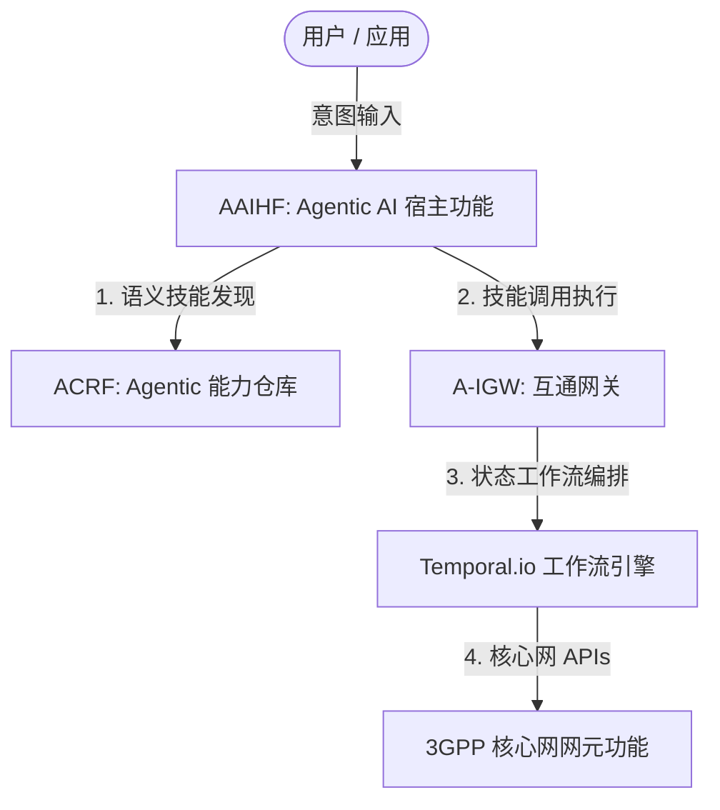
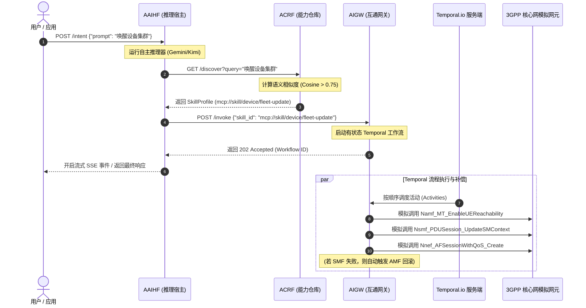

# 6G 基于技能的 Agentic 核心网 — 全局架构规范总结 (4+1 视图模型)

该文档对 [openspec/specs](../openspec/specs) 目录下的 14 个规范文件进行了全局性总结，并采用软件架构的 4+1 视图模型进行梳理。

整套系统通过语义技能注册表 (ACRF) 作为接口，将 AI 推理层 (AAIHF) 与确定性的、有状态的 3GPP 核心网信令编排层 (A-IGW) 进行解耦。



---

## 1. 逻辑视图 (功能与领域模型)
逻辑视图描述了系统的静态结构、类与结构体模型、接口定义以及业务实体。

### 技能配置文件与领域建模
*   统一的技能配置文件结构 (SkillProfile): 系统定义了一个核心的 [SkillProfile](../pkg/models/models.go) 结构体，其中包含一个强制性的 description 描述字符串（用于计算语义相似度向量）以及针对不同领域（Device 设备、Network 网络和 App 应用）的专用属性。
    *   规范参考: [agentic-models spec](../openspec/specs/agentic-models/spec.md)
    *   代码实现: [models.go](../pkg/models/models.go)
*   服务等级分类 (ServiceClass): 定义了 [ServiceClass](../pkg/models/models.go) 枚举类型（例如 GOLD, SILVER, BRONZE, PLATINUM），以便在注册表中对网络能力的优先级进行分级。
    *   规范参考: [agentic-models spec](../openspec/specs/agentic-models/spec.md)

### Agent 插件化工具接口
*   Agent 核心工具: 推理大模型驱动的 Agent 使用两个底层的核心工具：
    1.  SearchSkill: 封装了向 ACRF 发送 GET `/discover` 相似度查询或精确匹配。
    2.  ExecuteSkill: 封装了向 A-IGW 发送 POST `/invoke` 触发异步工作流。
    *   规范参考: [agent-tooling spec](../openspec/specs/agent-tooling/spec.md)
    *   代码实现: [tools.go](../internal/agent/tools.go)

### LLM 大模型适配层
*   OpenAI 兼容提供商: 为所有支持 OpenAI API 格式的大模型服务商提供了通用的 model.LLM 接口实现。它能将 adk-go 工具格式转为 OpenAI 工具描述规范，并支持通过自定义 API Base URL 切换服务商（如接入 Moonshot/Kimi）。
    *   规范参考: [openai-compatible-llm-provider spec](../openspec/specs/openai-compatible-llm-provider/spec.md)
    *   代码实现: [provider.go](../internal/agent/openai/provider.go)

### 语义匹配引擎
*   语义向量嵌入: 接入外部大模型（Gemini）生成文本描述的 float32 数值特征向量，并使用余弦相似度计算匹配程度。
*   匹配相似度阈值: 仅匹配余弦分数大于或等于默认值 0.75 的候选技能，否则对外返回未找到技能。
    *   规范参考: [semantic-matching-engine spec](../openspec/specs/semantic-matching-engine/spec.md)
    *   代码实现: [embeddings.go](../internal/registry/embeddings.go)

---

## 2. 过程视图 (工作流与运行时通信)
过程视图揭示了系统运行期间微服务组件之间的动态交互、时序机制、并发及补偿机制。



### 自然语言意图接收与 Agent 规划
*   意图解析与执行环: AAIHF 暴露 `/intent` 接收提示词，驱动 adk-go Agent 自主完成“语义检索技能 &rarr; 解析参数 &rarr; 触发网关调用”的闭环规划。
    *   规范参考: [intent-resolution spec](../openspec/specs/intent-resolution/spec.md)
    *   代码实现: [agent.go](../internal/agent/agent.go)

### 有状态 Temporal 工作流可靠编排
*   高可靠状态机: A-IGW 借助 Temporal.io 实现有状态、可重试、容忍临时基础设施崩溃的复杂网络技能调度。
*   事务补偿机制 (Saga 模式): 网络活动执行支持自动异常重试与显式的逆向事务补偿（例如，如果在 Fleet Wake-Up 流程中 SMF 会话更新永久性失败，系统会自动执行前置 AMF 状态的可达性回滚撤销操作）。
    *   规范参考: [temporal-skill-execution spec](../openspec/specs/temporal-skill-execution/spec.md)
    *   代码实现: [workflows.go](../internal/translator/temporal_skills/workflows.go) 与 [activities.go](../internal/translator/temporal_skills/activities.go)

### 状态实时可见性
*   SSE 实时事件广播: AAIHF 提供 `/stream` (Server-Sent Events) 端点，实时推送 AI 决策状态（如 reasoning_started、reasoning_completed）以供给前端仪表板，并遵守跨域访问策略 (`Access-Control-Allow-Origin: *`)。
    *   规范参考: [real-time-observability spec](../openspec/specs/real-time-observability/spec.md)
    *   代码实现: [server.go](../internal/agent/server.go)

---

## 3. 开发视图 (软件组织与测试验证)
开发视图重点关注代码在开发环境中的静态组织、包结构以及测试策略。

### 目录与包映射
```
.
├── cmd/
│   ├── aaihf/                   # AI 推理宿主服务入口
│   ├── acrf/                    # 能力注册仓库服务入口
│   └── igw-fleet/               # 互通网关服务入口
├── internal/
│   ├── agent/                   # 大模型适配、Agent 及 Tools 定义
│   ├── config/                  # 服务配置加载
│   ├── events/                  # 实时的 SSE 事件序列化组件
│   ├── registry/                # 技能发现与语义向量匹配
│   ├── testutil/                # 测试套件中的各类模拟桩 (Mocks)
│   └── translator/              # 互通网关与 Temporal Workers 逻辑
├── pkg/
│   └── models/                  # 共享的核心结构体与枚举定义
└── tests/
    └── features/                # BDD (行为驱动测试) 场景特性定义文件
```

### 测试验证基础设施 ("测试墙")
*   BDD 端到端集成测试: 项目引入了基于 godog 的行为驱动开发框架，在 [godog_test.go](../tests/godog_test.go) 中编写将自然语言意图转化为执行测试的逻辑，验证微服务间交互的端到端路径。
    *   规范参考: [test-infrastructure spec](../openspec/specs/test-infrastructure/spec.md)
    *   场景描述文件: [system.feature](../tests/features/system.feature)
*   Temporal 工作流隔离验证: 利用 Temporal 的虚拟测试套件（无需真实运行 Temporal 服务器组件）来模拟下游单个 Activity 失败，断言验证 Rollback 等补偿机制触发的正确性。
    *   规范参考: [test-infrastructure spec](../openspec/specs/test-infrastructure/spec.md)
    *   测试代码: [workflows_test.go](../internal/translator/temporal_skills/workflows_test.go)
*   MockAgent 本地纯管道回归: 支持使用 MockCoreAgent，在不进行实际外部大语言模型调用时，验证微服务之间的调用管道。
    *   规范参考: [automated-system-verification spec](../openspec/specs/automated-system-verification/spec.md)
    *   测试代码: [system_integration_test.go](../tests/system_integration_test.go)

---

## 4. 物理视图 (部署与配置管理)
物理视图概述了物理部署、环境变量、拓扑结构以及网络连接。

### 环境变量与配置机制
系统采用特定前缀 AGENTIC_ 的环境变量控制部署逻辑：
*   AGENTIC_LLM_PROVIDER: 选择语言大模型底层提供商（gemini 或 kimi）。
*   AGENTIC_KIMI_BASE_URL: 覆盖月之暗面 Kimi/Moonshot 模型服务的基础端点。
*   AGENTIC_TEMPORAL_HOST: 指向 Temporal 服务实例的地址（默认为本地的 127.0.0.1:7233）。
    *   规范参考: [openai-compatible-llm-provider spec](../openspec/specs/openai-compatible-llm-provider/spec.md)

### 端口回收与集成部署隔离
*   系统集成测试框架在运行测试前后会自动控制三个微服务的启动和停止，并确保在测试完成时清理并释放占用的端口，避免环境冲突。
    *   规范参考: [automated-system-verification spec](../openspec/specs/automated-system-verification/spec.md)
    *   实现: [system_integration_test.go](../tests/system_integration_test.go)

---

## 5. 场景视图 (+1 核心 MCP 技能映射)
场景视图通过描述系统核心的使用案例将其他视图串联起来。系统现阶段实现了以下 4 种网络技能映射：

| 技能唯一标识 (Skill ID / URI) | 目标核心网领域 | 对应的下游顺序 3GPP 核心网服务调用 | 规范参考 |
| :--- | :--- | :--- | :--- |
| `mcp://skill/device/fleet-update` | Device 设备 | `Namf_MT_EnableUEReachability` &rarr; `Nsmf_PDUSession_UpdateSMContext` &rarr; `Nnef_AFSessionWithQoS_Create` *(如失败触发 AMF 补偿回滚)* | [fleet-wake-up-translation spec](../openspec/specs/fleet-wake-up-translation/spec.md) |
| `mcp://skill/qos/turbo-mode` | Network 网络 (QoS) | `Nnef_AFSessionWithQoS_Create` &rarr; `Nnef_ChargeableParty_Create` &rarr; `Npcf_PolicyAuthorization_Update` | [qos-optimization spec](../openspec/specs/qos-optimization/spec.md) |
| `mcp://skill/reliability/path-diversity` | Network 网络 (可靠性) | `NNF_Generic_Control` &rarr; `Nsmf_PDUSession_UpdateSMContext` &rarr; `Nnef_TrafficInfluence_Create` | [reliability-enhancement spec](../openspec/specs/reliability-enhancement/spec.md) |
| `mcp://skill/edge/secure-flight` | Edge 边缘 / 位置 | `Nnef_TrafficInfluence_Create` &rarr; `Nnef_EventExposure_Subscribe` &rarr; `Ngmlc_Location_ProvideLocation` | [edge-secure-flight spec](../openspec/specs/edge-secure-flight/spec.md) |
